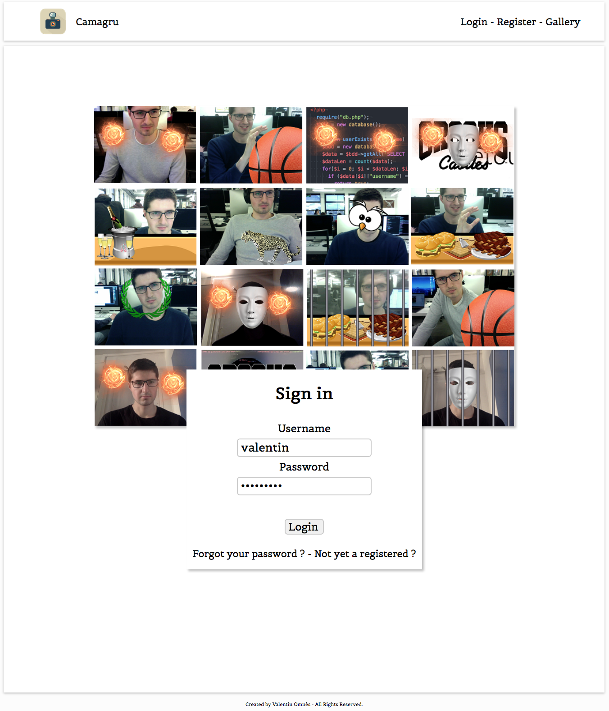
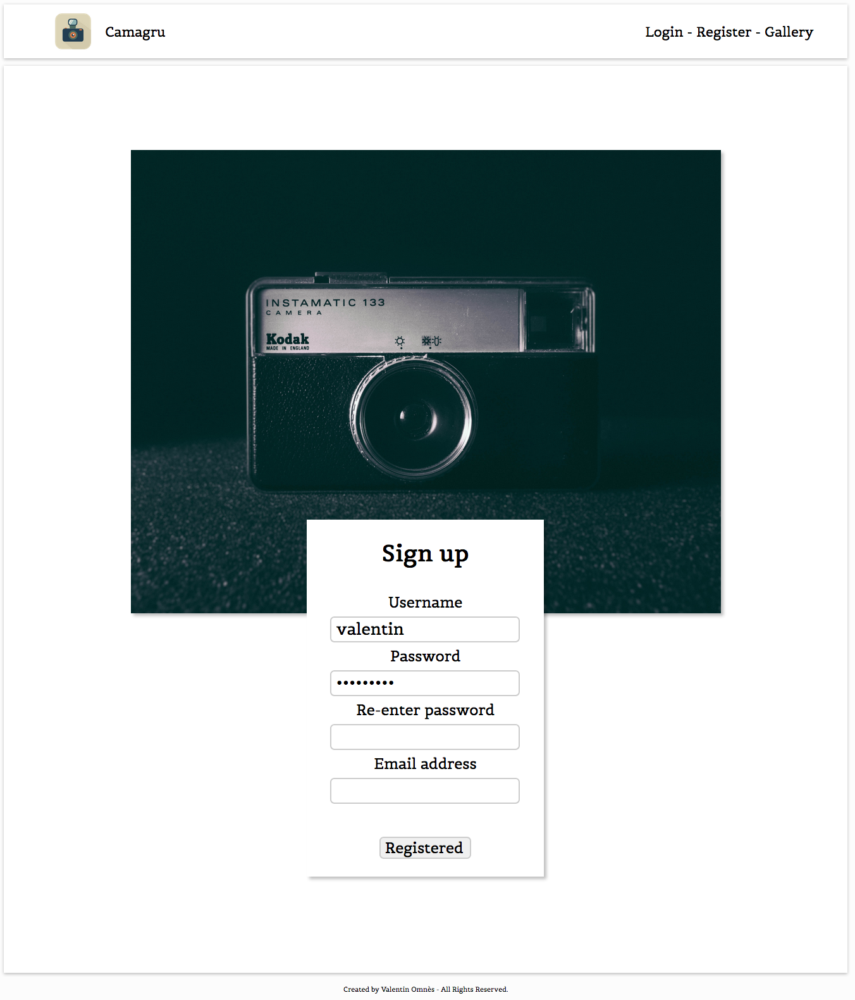
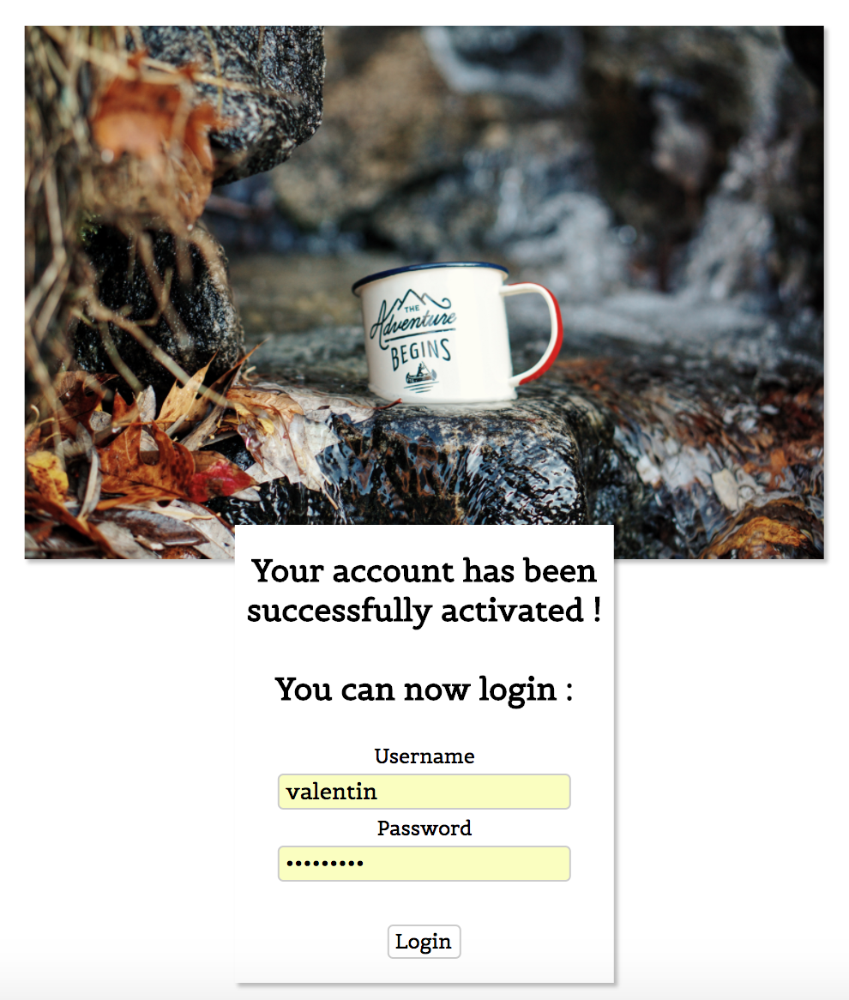
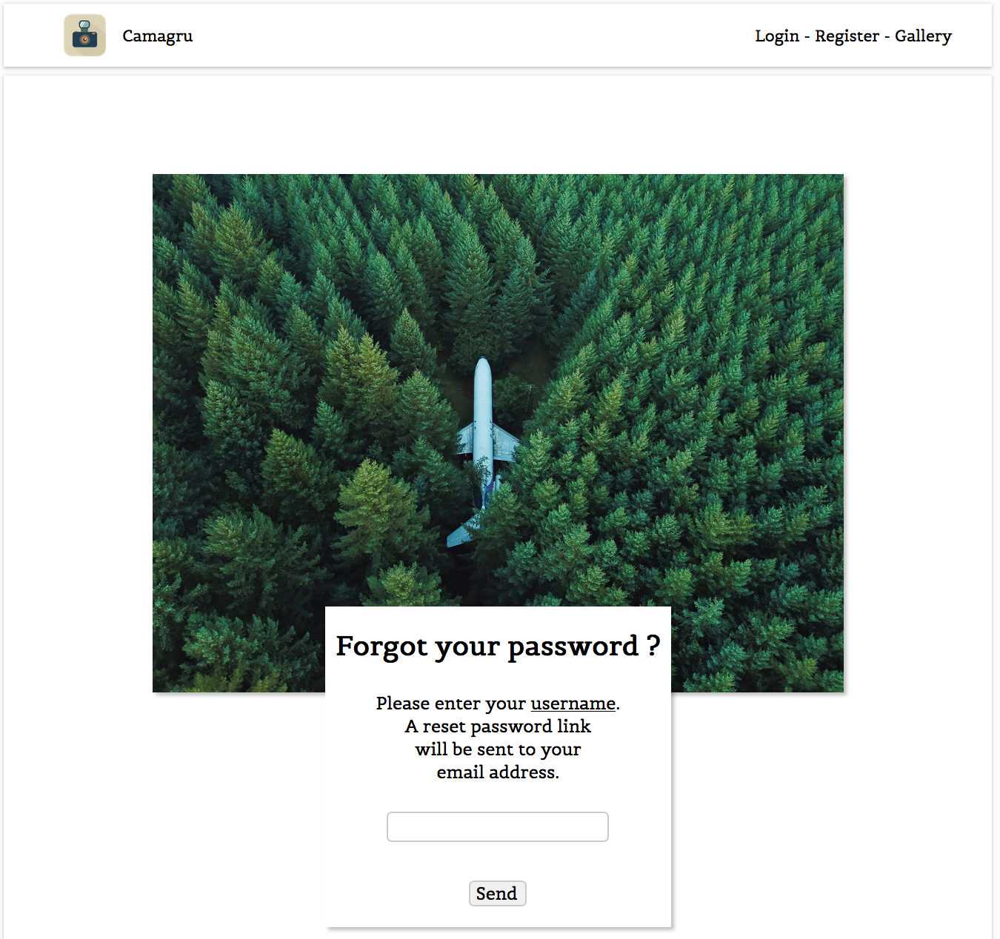
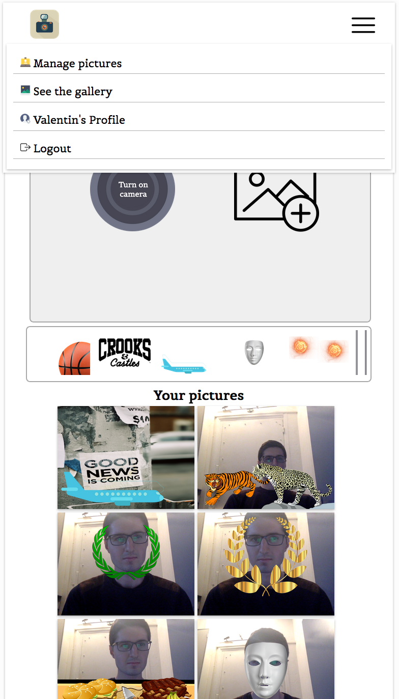
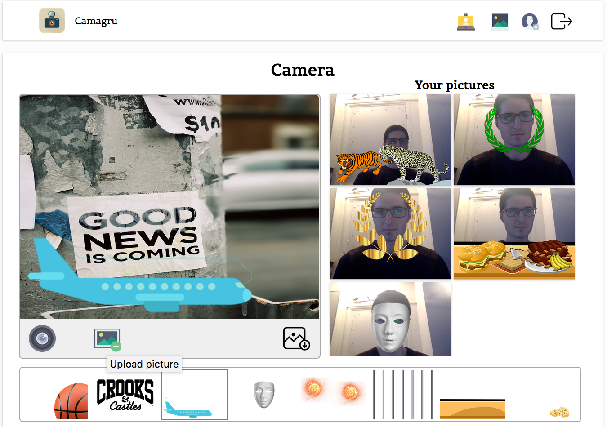
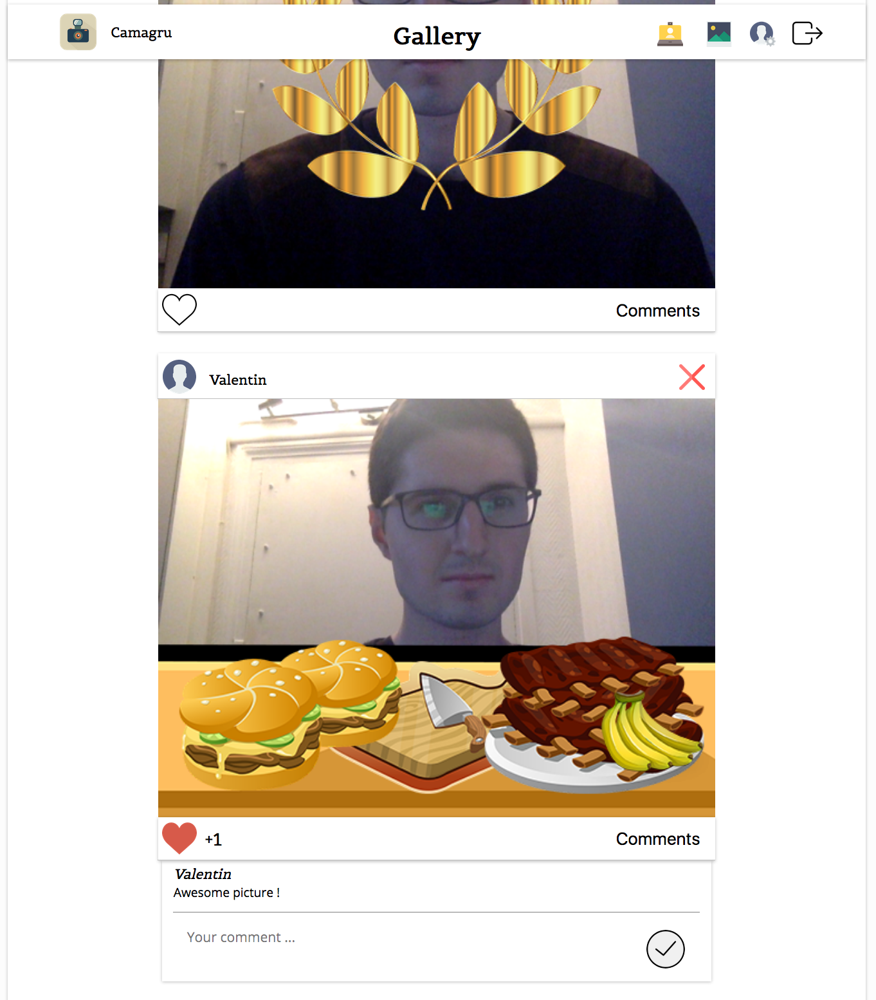

# Camagru
The aim of this project is to create a web application allowing to
make basic photo and video editing using your webcam and some predefined images.

I have realised this project during my studies at 'Ecole 42', it was my first big project in PHP.
I have done this project from scratch using PHP, Javascript, HTML et CSS without any frameworks.
I have organised my code using Model–View–Controller. Thus, there are only one page (index.php) and according the URL parameters a specific page is launched.
For example **_index.php?action=gallery_** launch the gallery page.

### Sign In
 

### Sign Up
 

### Account validated
 

### Password forgotten


### Camera


### Camera Responsive


### Upload picture


### Gallery


### Gallery Responsive


```localhost:8080/config/setup.php```
