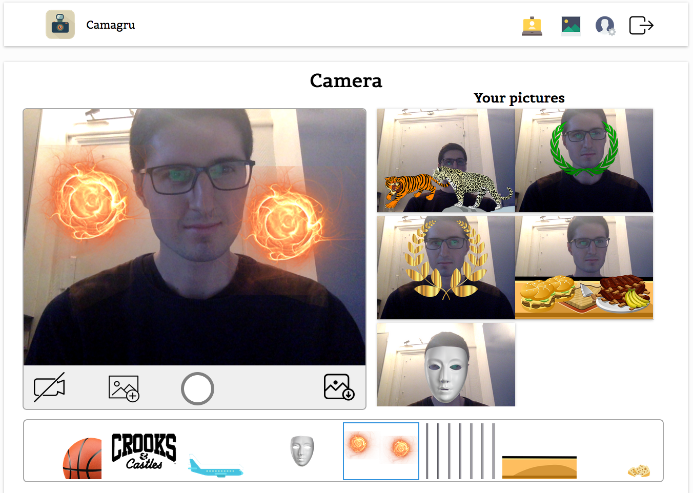
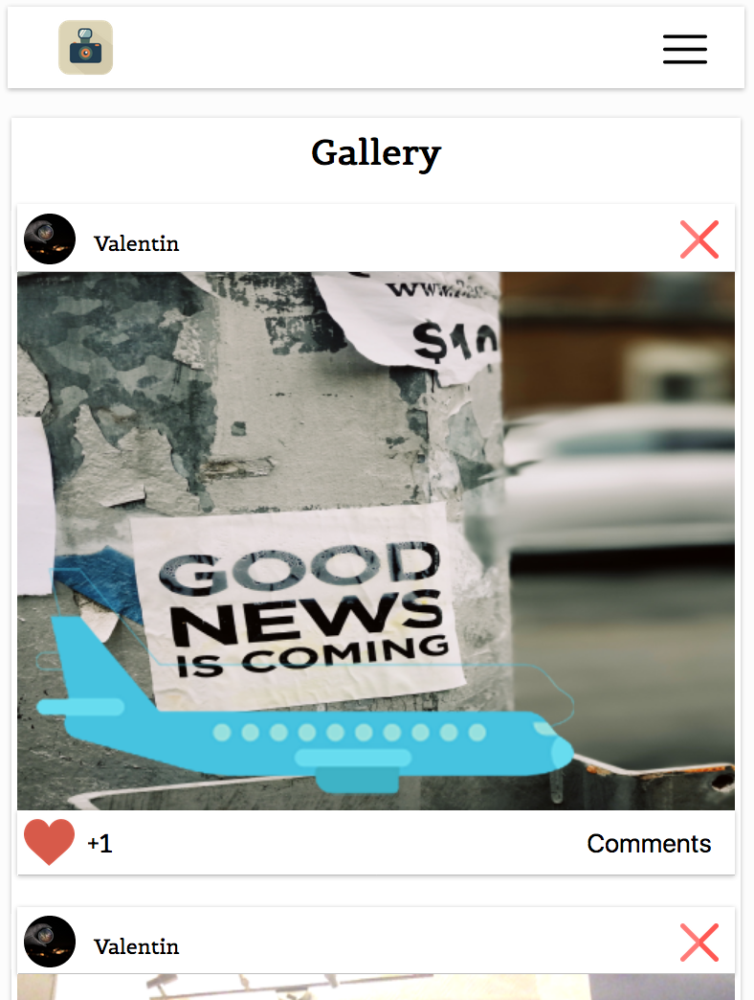

# Camagru
The aim of this project is to create a web application allowing to
make basic photo and video editing using your webcam and some predefined images.

I have realised this project from scratch using PHP, MYSQL, Javascript, HTML and CSS without any frameworks during my studies at 'Ecole 42', it was my first big project in PHP.

My code is organised using Model–View–Controller. Thus, there are only one page (_index.php_) and according the URL parameters a specific page is launched.
For example **_index.php?action=gallery_** launch the gallery page.

## Launch on Unix System
In your terminal :
#### PHP’s Built-in Server
```
   git clone https://github.com/vomnes/camagru.git
   cd camagru
   php -S localhost:8080 -t .
```
#### MySQL Server
```
   mysql.server start
```
#### Run
In order to initialise the database you need to go on this url **_localhost:8080/config/setup.php_**, then your can start to use Camagru by going on localhost:8080

## Some pictures
### Sign In
 

### Sign Up
 

### Account validated
 

### Password forgotten


### Camera


### Camera Responsive


### Upload picture


### Gallery


### Gallery Responsive

